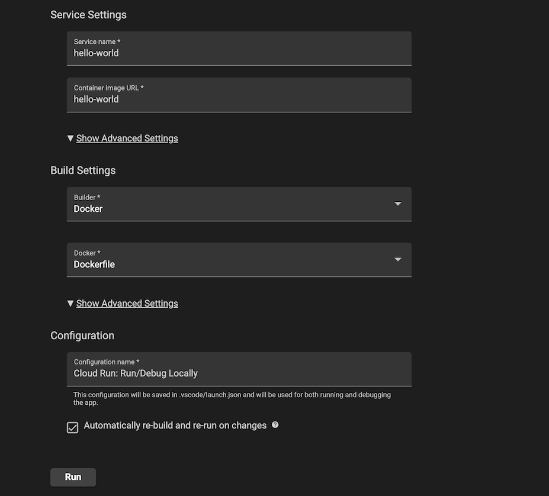

# Signaling Service - WebSocket server for negotiating 2-player games over RTC

## Design

### Why WebRTC?

Maximize privacy, minimize backend costs.

The WebRTC Spec intentionaly leaves out when/where/why/how two peers decide to connect because this can be accomplished in varied ways depending on the application needs. This is why we need a Signaling Service to agree on the protocols, IPs, and ports used to establish a connection using [ICE](https://datatracker.ietf.org/doc/html/rfc5245). We could use post-its delivered by carrier pigeon if we wanted, but a service will do it more efficiently.

### Signaling Service

In order to establish an `RTCPeerConnection`, each peer will open an a temporary `WebSocket` connection to the Signaling Service (Cloud Run Node.js app) for session negotiation to sync peers. Once the session negatiation process is complete according to the peers, we wait a little while to make sure no additional negotiation is required (to a better connection, for instance), then close the `WebSocket` connections on both ends, and tear down Cloud Run instance if there are no open sockets for any other signaling sessions. The main benefits of this approach are:
* This keeps Cloud Run utilization low by relying on WebRTC for game state communication, and will scale to 0 while no WebRTC sessions are being negotiated
* Low chance of scaling issues by using short-lived in-memory stores and ephemeral websocket connections (negotiations take seconds)
* Only one user step of sharing a URL which can be re-used if a connection is lost

#### Why Cloud Run

* App Engine Standard can scale to 0, bug does not support `WebSocket`s
* App Engine Flexible supports `WebSocket`s, but cold start time is lengthy and does not scale to 0, which is excess cost
* Cloud Compute is more than needed
* Cloud Run enables use of GKE for future needs

### Process and Diagram

1. `Player1` generates a `game` (go, connect4, tictactoe) `code` (UUID) via the signaling service, which it stores in-memory in the hierarchy shown below 
    1. `code` will be generated as a `randomUUID`, checked for collisions in the store, recreated as necessary, and used as the key for the signaling state, which will be constructed as follows:
        1. `state` will be initialized to `'new'`
        2. `startTime` will be initialized to the Epoch since 1/1/1970 in GMT
        2. For both `player1` and `player2` objects:
            1. `id` will be initialized to `""` 
            2. `socket` will be initialized to `null`
            3. `iceCandidates` will be initialized to `[]`
            4. `isRtcConnected` will be initialized to `false`
    2. `Player1`s `id` will be set to a short, quick hash `H([game]:[code]:'player1')`. 
        1. __Note:__ This is not meant to be cryptographically secure, just unique. We're just playing P2P games with a friend over HTTPS/WSS, after all. (See Threat Modeling section below when complete, this could change)
    3. Start a 10 minute timer. If by the end of the timer either `player1` or `player2` do not both have valid `id` and `socket` properties, close all open sockets for this `[game][code]` tuple
    4. Respond with `{code, id}`
2. `Player1` opens a `WebSocket` connection to the Signaling service with the `game` and newly created `code` and `id` parameters
      1. Step 6 can begin with `player1` warming up their `RTCPeerConnection` by starting the gathering of ICE candidates, and transmitting them to the Signaling Server over the `WebSocket`
3. __OUT OF BAND__ `Player1` sends the code via URL to `Player2`: `[URL]/#game:code` via SMS, email, etc.
4. `Player2` opens `[URL]/#game:code`, which opens a `WebSocket` connection to the Signaling Service with `game` and `code` parameters
    1. `Player2` Creates an `RTCPeerConnection` to start gathering ICE candidates
    2. If the `[game][code]` tuple doesnt appear in the store, a race conditioned occurred where the timer defined in Step 1.3 has closed this session, or the Signaling Service instance is not shared (TODO: Can we find the instance where the tuple does exist and hand off to that instance? Problem of scale to be solved later). Log an error, close the socket, prompt user to start the process over as `Player1`
5. Emit on `player1`'s `WebSocket` to start session negotiation as described in the [WebRTC Spec](https://www.w3.org/TR/webrtc/#session-negotiation-model)
over the linked sockets. 
6. Simplified version of [WebRTC Sequence Diagram](https://www.w3.org/TR/webrtc/images/ladder-2party-simple.svg)
    1. __Note:__ This sequence could start from either side of the connection if the RTC connection is lost, so `player1` and `player2` roles *could* be reversed. The Signaling Service should be intelligent enough to know the difference between players and adjust messaging as needed.
7. `player2` will receive a  `'datachannel'` event to accept the basic data channel that was created by `player1`. Creating an answer after this event will provide `player1` with the answer required to start transmitting data (as soon as ICE candidates are negotiated)
8. Since `RTCPeerConnection`s have been set up prior, they will have started trying to connect to STUN servers and provide successful ICE candidates in the `'icecandidate'` event once a local or remote description have been applied to the `RTCPeerConnection`. Both peers will be emitting their `iceCandidate`s to the Signaling Service over their respsective `WebSocket` as they are established
9. The Signaling Service will collect these candidates, pushing them to the respective `[game][code].player[n].iceCandidates`. Ideally we would use [Trickle ICE](https://datatracker.ietf.org/doc/html/rfc8838) to trickle in ICE Candidates to `player2`, but currently only Firefox supports it. [[1]](https://developer.mozilla.org/en-US/docs/Web/API/RTCPeerConnection/canTrickleIceCandidates#browser_compatibility) [[2]](https://stackoverflow.com/questions/61710759/trickle-ice-not-working-in-chrome-but-fine-in-firefox) 
    1. Since `player1`'s `RTCPeerConnection` warms up the Signaling Service with ICE Candidates as described in Step 2.1, as soon as `player2` connects to the Signaling Service, we should already have some(all) of the ICE candidates for `player1` and we can quickly(immediately) send them to `player2` over the `WebSocket` connection.
10. When the `'connectionstatechange'` event fires on the peers, if they are connected successfully, they will emit to the Signaling Server `'rtcConnected'`. Once the Signaling server receives this from both peers, the `WebSocket`s will be torn down.
    1. If a player receives a `'connectionstatechange'` event and the `connectionState` is `'failed'`
       then the peers couldnt connect, TBD if retry would be successful, but guessing not.
11. Do some cleanup on the Signaling Server for all games where one of the following conditions is met:
    1. `state === 'rtcConnected'`
    2. `currentTime - startTime > 15 * 60 * 1000` denoting negotiation sessions can last at most 15 minutes.
    3. `state === 'rtcFailed'`
```
enum state{
  'new',       // No sockets connected
  'waiting',   // Player1 connected to Signaling Service
  'connected', // Player2 connected to Signaling Service
  'negotiating', // waiting for offers/answers/ICE candidates
  'rtcConnected', // exit 
  'rtcFailed' // failed, report and exit?
}

string playerID{ H([game]:[code]:player[n]) }

                                |-------------------------------|
                                |  In-Memory Store Schema       |
                                |-------------------------------|
                                |  [game][code]: {              |
                                |     state: Enum(state)        |
                                |       startTime: datetime     |
                                |     player1:                  |
                                |       id: playerID            |
                                |       socket:WebSocket        |
                                |       iceCandidates: []       |
                                |       isRtcConnected false    |
                                |     player2:                  |
                                |       id: playerID            |
                                |       socket:WebSocket        |
                                |       iceCandidates: []       |
                                |       isRtcConnected false    |
                                |  }                            |
                                |                               |
Player1                         |  Signaling Service            |  Player2
--------------------------------|-------------------------------|-------------------------------
1. getGameCode(game)------------|->1. creates code & playerID   |
                                |     stores signaling state    |
                                |     data under [game][code]   |
1. recGameCode(code,id)<--------|-----returns code & playerID   | 
2. openSocket(game,code,id)-----|->2. set player1 socket        |
   Creates RTCPeerConnection    |     set state = 'waiting'     |
3. Shares url with Player2---------------------------------------->3. Opens URL
                                |  4. associate player2 socket<-|--4. openSocket(game,code)
                                |     create playerID, store    |     Creates RTCPeerConnection
                                |     state = 'connected'       |
                                |     return playerID-----------|->4. socket.onopen(id)
5. socket.onmesssage<-----------|--5. Signal to start WebRTC    |     store id localStorage
6. createOffer()                |     session negotiation       |
   setLocalDesc(offer)          |                               |     
   socket.emit({offer, id})-----|->6. player1.socket.onmessage  |
                                |     state = 'negotiating'     |
                                |     pleyer2.socket.emit-------|->6. socket.onmessage({offer})
                                |                               |     setRemoteDesc(offer)
                                |                               |     createAnswer()
                                |                               |     setLocalDesc(pranswer)
                                |  6. player2.socket.onmessage<-|-----socket.emit({pranswer, id})
6. setRemoteDesc(pranswer)<-----|-----player1.socket.emit       |
                                |                               |  7. 'datachannel' event
                                |                               |     createAnswer()
                                |                               |     setLocalDesc(answer)
                                |  7. player2.socket.onmessage<-|-----socket.emit({answer, id})
7. setRemoteDesc(answer)<-------|-----player1.socket.emit       |
8. 'iceCandidate' event         |                               |  8. 'iceCandidate' event
    socket.emit({iceCandidate})-|->8. collect iceCandidates<----|-----socket.emit({iceCandidate})
                                |     for each player           |
                                |  9. when we get all candidates|
                                |     for a given player,       |
                                |     emit iceCandidates        |
                                |     to the other player       |
                                |     player2.socket.emit-------|->9. socket.onmessage
9. socket.onmessage<------------|-----player1.socket.emit       |     setIceCandidate()
   setIceCandidate()            |                               |     
                                |                               |
10. 'connectionstatechange' evt |                               |  10. 'connectionstatechange' event
    if connected,               |                               |      if connected,
    socket.emit('rtcConnected')-|->10. set isRtcConnected to<---|------socket.emit('rtcConnected')
                                |      true for the player.     |
                                |      If both are true,        |
                                |      state = 'rtcConnected'   |
                                |      close down the sockets   |
 
```

### Threat Modeling

#### Websocket Session Hijacking

* If someone brute-force-guesses a UUID `code` that is actually valid in an instance with no `player2` they automatically get to be `player2`, hijacking the session
    * Pretty low probability given the ephemeral nature of the `WebSocket` connection and low probability of UUID collisions, but possible
    * Instead of sharing the `code` as obviously a UUID, we could encrypt it with AES-GCM using a randomized symmetric key per session and pass the ciphertext instead as `[URL]/#[game]:[ciphertext]`. This adding overhead to the initial session setup time (how much?)

#### Data Overflow

* Max ICE Candidates per player (TODO: How many is typical?), preserves memory/prevents overflow
* Max Cloud Run instances to mitigate financial impact of DDoS or Traffic spikes, thinking 1 to start with is plenty, max concurrent sessions can be extended above 1000 if necessary [as suggested by GCP](https://cloud.google.com/run/docs/triggering/websockets#maximize-concurrency)
* All data flowing from browser to Signaling Service should be validated against a JSON schema and always contain the `playerID`

* Max session negotiation time of 15min: Track and reduce to minimum viable time, its probably lower

#### DDoS

* Builtin GCP protections for DDoS?
* More than a few attempts with wrong ciphertext from a single origin is sus
* Rate limiting?
* Excessively chatty websockets should be shut down
    * Define this

### Testing

TODO: This will be interesting to automate...

### Ops

TODO: Logging/Analytics, GCP Cloud Run config


---
## Getting Started with VS Code

### Run the app locally with the Cloud Run Emulator
1. Click on the Cloud Code status bar and select 'Run on Cloud Run Emulator'.  


2. Use the Cloud Run Emulator dialog to specify your [builder option](https://cloud.google.com/code/docs/vscode/deploying-a-cloud-run-app#deploying_a_cloud_run_service). Cloud Code supports Docker, Jib, and Buildpacks. See the skaffold documentation on [builders](https://skaffold.dev/docs/pipeline-stages/builders/) for more information about build artifact types.  


3. Click ‘Run’. Cloud Code begins building your image.

4. View the build progress in the OUTPUT window. Once the build has finished, click on the URL in the OUTPUT window to view your live application.  


5. To stop the application, click the stop icon on the Debug Toolbar.
